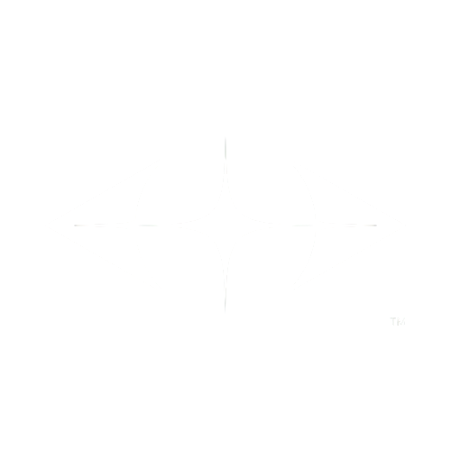

<a id="readme-top"></a>

<!-- Standard Project Badges -->
[](https://github.com/LukasRennhofer/Vantor/issues)
[](https://github.com/LukasRennhofer/Vantor/blob/main/LICENSE)
[](https://github.com/LukasRennhofer/Vantor/actions)
[](https://www.codefactor.io/repository/github/LukasRennhofer/Vantor)
[](https://github.com/LukasRennhofer/Vantor/commits)

<!-- PROJECT LOGO -->
<br />
<div align="center">
  <a href="https://github.com/LukasRennhofer/Vantor">
    
  </a>

<h3 align="center">Vantor Engine™</h3>
  <p align="center">
    Low-Level Experimental In-House Game Engine for VantorStudios
    <br />
    <h5 align="center">
    <strong>v0.20.X - Experimental Build</strong>
    </h5>
    <a href="https://docs.vantor.net/"><strong>Explore the docs »</strong></a>
    <br />
    <br />
    <a href="https://docs.vantor.net/docs/category/getting-started">Get Started</a>
    &middot;
    <a href="https://github.com/LukasRennhofer/Vantor/issues/new?labels=bug&template=bug-report---.md">Report Bug</a>
    &middot;
    <a href="https://github.com/LukasRennhofer/Vantor/issues/new?labels=enhancement&template=feature-request---.md">Request Feature</a>
    &middot;
    <a href="#vantorstudios">Vantor Studios™</a>
  </p>
</div>

<!-- TABLE OF CONTENTS -->
<details>
  <summary>Table of Contents</summary>
  <ol>
    <li>
      <a href="#about-the-project">About The Project</a>
      <ul>
        <li><a href="#vantorstudios">Vantor Studios™</a></li>
        <li><a href="#built-with">Built With</a></li>
        <li><a href="#experimental-status">Experimental Status</a></li>
      </ul>
    </li>
    <li>
      <a href="#getting-started">Getting Started</a>
      <ul>
        <li><a href="#prerequisites">Prerequisites</a></li>
        <li><a href="#installation">Installation</a></li>
      </ul>
    </li>
    <li><a href="#usage">Usage</a></li>
    <li><a href="#development-tools">Development Tools</a></li>
    <li><a href="#roadmap">Roadmap</a></li>
    <li><a href="#contributing">Contributing</a></li>
    <li><a href="#license">License</a></li>
    <li><a href="#contact">Contact</a></li>
    <li><a href="#acknowledgments">Acknowledgments</a></li>
  </ol>
</details>

<!-- ABOUT THE PROJECT -->
## About The Project

<!--<p align="center">

</p>-->

**Vantor Engine™** is a low-level, experimental game engine developed in-house by **Vantor Studios™** for creating high-performance games. Designed from the ground up with a focus on **minimal abstraction** and **maximum control**, Vantor provides game developers with direct access to rendering pipelines, memory management, and system resources.

The engine prioritizes **performance**, **modularity**, and **flexibility** over ease of use, making it ideal for developers who need fine-grained control over every aspect of their game's execution. Built with modern C++20 and OpenGL, Vantor serves as the foundation for VantorStudios' game development projects.

### Key Philosophy
- **Low-Level Control**: Direct manipulation of rendering, physics, and resource systems
- **Performance First**: Optimized for real-time applications and resource-constrained environments  
- **Modular Architecture**: Use only what you need, extend what you want
- **Experimental Nature**: Cutting-edge features and techniques in active development

> *"A delayed game is eventually good, a rushed game is bad forever."* – **Shigeru Miyamoto**

### Vantor Studios™

VantorStudios is an independent, hobby-driven game development studio focused on creating unqiue gaming experiences. The Vantor Engine serves as our proprietary technology stack, powering our internal game development projects and providing the technical foundation for our creative vision.


### Experimental Status

⚠️ **Important Notice**: Vantor Engine is currently in **experimental development status**. This means:

- **Rapid Changes**: APIs and architecture may change frequently
- **Limited Documentation**: Focus is on development rather than user documentation  
- **Internal Use Priority**: Designed primarily for VantorStudios' development needs
- **Community Contributions**: Welcome but may be adapted to fit internal roadmap
- **No Stability Guarantees**: Breaking changes can occur between versions

The engine is made available for educational purposes and community collaboration, but production use is not recommended until a stable release is announced.

<p align="right">(<a href="#readme-top">back to top</a>)</p>

### Built With

The Vantor Engine is built using modern technologies and industry-standard tools:

[![C++][C++-badge]][C++-url] [![OpenGL][OpenGL-badge]][OpenGL-url] [![Vulkan][Vulkan-badge]][Vulkan-url] [![GLSL][GLSL-badge]][GLSL-url] [![Python][Python-badge]][Python-url] [![Dear ImGui][ImGui-badge]][ImGui-url] [![SDL2][SDL2-badge]][SDL2-url] [![CMake][CMake-badge]][CMake-url]

**Core Technologies:**
- **C++20**: Modern C++ with latest language features
- **OpenGL 4.6**: Primary rendering API with Vulkan support planned
- **Custom GLSL Shaders**: Hand-optimized graphics shaders
- **Python**: Development tools and build automation (VTRG)
- **CMake**: Cross-platform build system

**Third-Party Libraries:**
- **Dear ImGui**: Immediate mode GUI for debugging and tools
- **GLFW**: Window management and input handling
- **STB Headers**: image loading and writing
- **tinygltf.h**: glTF 2.0 object loading and animations
- **tinyobjloader**: .obj and mtl object loading

<p align="right">(<a href="#readme-top">back to top</a>)</p>

<!-- GETTING STARTED -->
## Getting Started

> **⚠️ Warning**: This engine is experimental and intended primarily for VantorStudios development. APIs may change without notice.

To get started with Vantor Engine development, follow these steps. Note that the engine is designed for experienced C++ developers familiar with low-level graphics programming.

### Prerequisites

Before building Vantor, ensure you have the following installed:

**Required:**
- **CMake** (3.10 or higher)
- **Make** or **Ninja** build system
- **C++20 capable compiler**:
  - MSVC 2019+ (Windows)
  - GCC 10+ (Linux)
  - Clang 12+ (Cross-platform)
- **Git** for version control
- **Python 3.7+** for development tools (VTRG)

**Optional but Recommended:**
- **clang-format** for code formatting
- **Visual Studio Code** or similar IDE with C++ support

### Building

#### Windows (Recommended Platform)

**Step 0: Setup Environment**

Install MSYS2 from [their website](https://www.msys2.org/) and Python from [python.org](https://www.python.org/).

**Step 1: Clone Repository**

```bash
git clone https://github.com/LukasRennhofer/Vantor.git
cd Vantor
```

**Step 2: Install Dependencies**

```bash
pacman -S cmake mingw-w64-x86_64-toolchain mingw-w64-x86_64-freeglut mingw-w64-x86_64-assimp mingw-w64-x86_64-sdl2
```

**Step 3: Build Engine**

```bash
# Using the new VTRG development tool
python vtrg.py build --platform Windows --debug

# Or using legacy DevConsole (deprecated)glTF 2.0 object loading and animations
python DevConsole.py --platform Windows --build-lib
```

#### Linux (Experimental Support)

> **⚠️ Status**: Linux support is experimental and may have build issues. Tested on Ubuntu 24.10.

**Step 0: Install Python**
```bash
sudo apt-get install python3
```

**Step 1: Clone Repository**
```bash
git clone https://github.com/LukasRennhofer/Vantor.git
cd Vantor
```

**Step 2: Install Dependencies**
```bash
sudo apt-get install build-essential libsdl2-dev libsdl2-2.0-0 libassimp-dev cmake libglm-dev libglew-dev
```

**Step 3: Build Engine**
```bash
# Using VTRG (recommended)
python3 vtrg.py build --platform Linux --debug

# Or using legacy DevConsole
python3 DevConsole.py --platform Linux --build-lib
```

<p align="right">(<a href="#readme-top">back to top</a>)</p>

<!-- USAGE EXAMPLES -->
## Usage

Vantor Engine™ is designed for experienced developers who need low-level control over game systems. Here are some ways to use the engine:

### Basic Integration

```cpp
#include <Vantor/Vantor.hpp>

#include <iostream>

// Create RHI device
auto device = Vantor::RHI::VRDCoordinator::Instance().CreateDevice(Vantor::RHI::EGraphicsAPI::OPENGL);

// Vertex structure with position + color
struct Vertex {
    Vantor::Math::VVector3 position;
    Vantor::Math::VVector3 color;
};

void ResizeCallback(int w, int h) {
        device->SetViewport(0, 0, w, h);
}

int main() {

    // Create the window
    Vantor::Context::VWindow* window = new Vantor::Context::VWindow(1920, 1080, "Legendary Triangle");
    

    if (!device->Initialize()) {
        std::cerr << "Failed to initialize RHI device" << std::endl;
        return 1;
    }

    window->setResizeCallback(ResizeCallback);


    // Define a colorful triangle
    Vantor::Core::Container::TVector<Vertex> vertices = {
        {{-0.5f, -0.5f, 0.0f}, {1.0f, 0.0f, 0.0f}}, // Red
        {{ 0.5f, -0.5f, 0.0f}, {0.0f, 1.0f, 0.0f}}, // Green
        {{ 0.0f,  0.5f, 0.0f}, {0.0f, 0.0f, 1.0f}}  // Blue
    };
    Vantor::Core::Container::TVector<uint32_t> indices = {0, 1, 2};

    // Vertex layout: position + color
    Vantor::RHI::VVertexLayout layout;
    layout.stride = sizeof(Vertex);
    layout.attributes = {
        {0, Vantor::RHI::ERHIFormat::R32G32B32_FLOAT, offsetof(Vertex, position)},
        {1, Vantor::RHI::ERHIFormat::R32G32B32_FLOAT, offsetof(Vertex, color)}
    };

    auto mesh = device->CreateMesh(
        vertices.data(),
        vertices.size() * sizeof(Vertex),
        indices.data(),
        indices.size(),
        layout
    );
    // ... See Template Sample
```

### Sample Projects

The engine includes several sample projects in the `Samples/` directory:

- **Sandbox**: Basic engine showcase and testing environment
- **LightDemo**: Demonstration of lighting systems
- **Template**: Starting point for new projects

### Running Samples

```bash
# Build and run a sample using VTRG
python vtrg.py build --sample Sandbox --platform Windows --run

# Format code before contributing
python vtrg.py format

# Clean build artifacts
python vtrg.py clean --all
```

_For more detailed examples and API documentation, please refer to the [Documentation](Documentation/)_

## Development Tools

### VTRG (Vantor Trigger)

VTRG is the enhanced command-line development tool for Vantor Engine:

```bash
# Build commands
python vtrg.py build --help
python vtrg.py build --sample MyProject --debug --run

# Code formatting
python vtrg.py format --check
python vtrg.py format --path ./Source

# Cleanup
python vtrg.py clean --build
python vtrg.py clean --all --dry-run

# Get help
python vtrg.py --help
python vtrg.py build --help
```

### Features:
- **Multi-platform building** with platform-specific optimizations
- **Dependency checking** and validation
- **Build artifact management** and cleanup

<p align="right">(<a href="#readme-top">back to top</a>)</p>

<!-- ROADMAP -->
## Roadmap

### Current Focus (v0.16.x)
- [🟩] **Platform Abstraction Layer** - Windows/Linux/Switch support
- [�] **Core Rendering Pipeline** - OpenGL 4.6 implementation
- [🟧] **Memory Management** - Custom allocators and resource pooling
- [🟩] **Scene Graph** - Efficient spatial organization

### Near-term Goals (v0.17.x - v0.20.x)
- [🟧] **Multi-threaded Resource Management** - Async loading and streaming
- [🟧] **GPU-based Scene Graph** - GPU-driven rendering pipeline
- [🟩] **Editor Interface** - Basic level editor and debugging tools
- [🟥] **Audio System** - 3D spatial audio implementation

### Long-term Vision (v1.0+)
- [🟥] **Full Vulkan Support** - Modern low-level graphics API
- [🟥] **Advanced Physics** - Custom physics simulation
- [🟥] **Networking Layer** - Multiplayer game support
- [🟩] **Documentation Expansion** - Comprehensive API documentation

**Legend:**
- 🟩 Complete
- 🟧 In Progress  
- 🟥 Planned

> **Note**: Roadmap priorities may change based on VantorStudios' internal development needs.

See the [open issues](https://github.com/LukasRennhofer/Vantor/issues) for detailed feature requests and known issues.

<p align="right">(<a href="#readme-top">back to top</a>)</p>

<!-- LICENSE -->
## License

Distributed under the GNU General Public License, v3. See `LICENSE` for more information.

<p align="right">(<a href="#readme-top">back to top</a>)</p>

<!-- CONTACT -->
## Contact

**Vantor Studios™**

- Lukas Rennhofer
- Moritz Rottensteiner

**Lead Developer:** Lukas Rennhofer  
📧 Email: lukas.renn@aon.at  

**Project Repository:** [https://github.com/LukasRennhofer/Vantor](https://github.com/LukasRennhofer/Vantor)

For technical questions, bug reports, or feature requests, please use the [GitHub Issues](https://github.com/LukasRennhofer/Vantor/issues) system.

<p align="right">(<a href="#readme-top">back to top</a>)</p>

<!-- ACKNOWLEDGMENTS -->
## Acknowledgments

**Vantor Studios™** would like to thank:

* **Open Source Community** - For the foundational libraries and tools that make Vantor possible
* **Technical Inspirations:**
  * [WickedEngine](https://github.com/turanszkij/WickedEngine) - Modern C++ game engine architecture
  * [Godot Engine](https://github.com/godotengine/godot) - Open source game engine design patterns
  * [Unreal Engine](https://www.unrealengine.com/) - Industry-standard rendering techniques
* **Library Contributors:**
  * [Dear ImGui](https://github.com/ocornut/imgui) - Immediate mode GUI framework
  * [SDL2](https://www.libsdl.org/) - Cross-platform development library
  * [Assimp](https://github.com/assimp/assimp) - 3D model loading library
  * [GLFW](https://www.glfw.org/) - Window and input management
* **Development Tools:**
  * [CMake](https://cmake.org/) - Cross-platform build system
  * [clang-format](https://clang.llvm.org/docs/ClangFormat.html) - Code formatting
  * [GitHub](https://github.com/) - Version control and collaboration

**Special Recognition:**
- All contributors who help improve the engine
- The game development community for sharing knowledge and best practices
- Beta testers and early adopters who provide valuable feedback

---

<div align="center">

**Vantor Engine™** - Experimental Low-Level Game Engine  
*Developed by Vantor Studios™ (Lukas Rennhofer, Moritz Rottensteiner)*
</div>

<p align="right">(<a href="#readme-top">back to top</a>)</p>

<!-- MARKDOWN LINKS & IMAGES -->
[contributors-shield]: https://img.shields.io/github/contributors/LukasRennhofer/Vantor.svg?style=for-the-badge
[contributors-url]: https://github.com/LukasRennhofer/Vantor/graphs/contributors
[forks-shield]: https://img.shields.io/github/forks/LukasRennhofer/Vantor.svg?style=for-the-badge
[forks-url]: https://github.com/LukasRennhofer/Vantor/network/members
[stars-shield]: https://img.shields.io/github/stars/LukasRennhofer/Vantor.svg?style=for-the-badge
[stars-url]: https://github.com/LukasRennhofer/Vantor/stargazers
[issues-shield]: https://img.shields.io/github/issues/LukasRennhofer/Vantor.svg?style=for-the-badge
[issues-url]: https://github.com/LukasRennhofer/Vantor/issues
[license-shield]: https://img.shields.io/github/license/LukasRennhofer/Vantor.svg?style=for-the-badge
[license-url]: https://github.com/LukasRennhofer/Vantor/blob/master/LICENSE.txt
[linkedin-shield]: https://img.shields.io/badge/-LinkedIn-black.svg?style=for-the-badge&logo=linkedin&colorB=555
[linkedin-url]: https://linkedin.com/in/lukas-rennhofer
[C++-badge]: https://img.shields.io/badge/C%2B%2B-00599C?style=for-the-badge&logo=c%2B%2B&logoColor=white
[C++-url]: https://isocpp.org/
[OpenGL-badge]: https://img.shields.io/badge/OpenGL-5586A4?style=for-the-badge&logo=opengl&logoColor=white
[OpenGL-url]: https://www.opengl.org/
[Vulkan-badge]: https://img.shields.io/badge/Vulkan-AC162C?style=for-the-badge&logo=vulkan&logoColor=white
[Vulkan-url]: https://www.khronos.org/vulkan/
[GLSL-badge]: https://img.shields.io/badge/GLSL-FF6C00?style=for-the-badge&logo=opengl&logoColor=white
[GLSL-url]: https://www.khronos.org/opengl/wiki/OpenGL_Shading_Language
[Python-badge]: https://img.shields.io/badge/Python-3670A0?style=for-the-badge&logo=python&logoColor=white
[Python-url]: https://www.python.org/
[ImGui-badge]: https://img.shields.io/badge/ImGui-9C27B0?style=for-the-badge
[ImGui-url]: https://github.com/ocornut/imgui
[Raylib-badge]: https://img.shields.io/badge/Raylib-000000?style=for-the-badge
[Raylib-url]: https://www.raylib.com/
[SDL2-badge]: https://img.shields.io/badge/SDL2-FF6C00?style=for-the-badge
[SDL2-url]: https://www.libsdl.org/
[CMake-badge]: https://img.shields.io/badge/CMake-064F8C?style=for-the-badge&logo=cmake&logoColor=white
[CMake-url]: https://cmake.org/